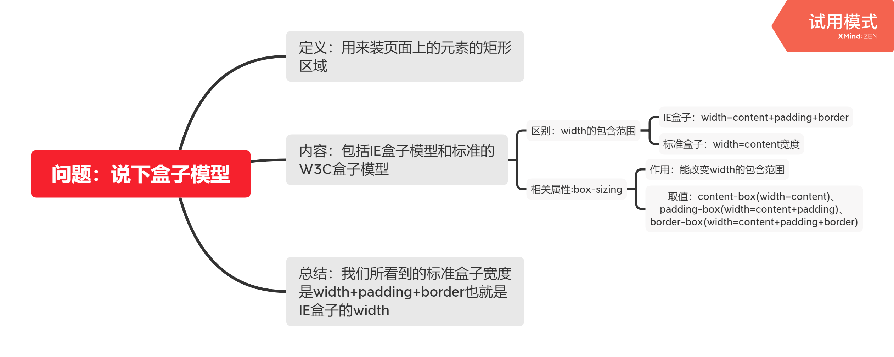
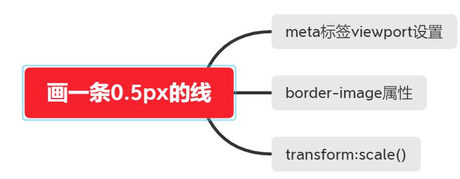

### 1.说下css盒模型

### 2.画一条0.5px的线
**疑问：**
	直接设置height:0.5px不就行了嘛？
**实践：**
	```
	//详见 demo/1.html
	```
**结论：**
	直接设置高度0.5px和1px，在谷歌浏览器上的效果几乎是一样的。
	因为理论上1px已经是最小的单位。


**实现方案：**


**实践：**
	```
	//详见 demo/2.html、demo/3.html
	```