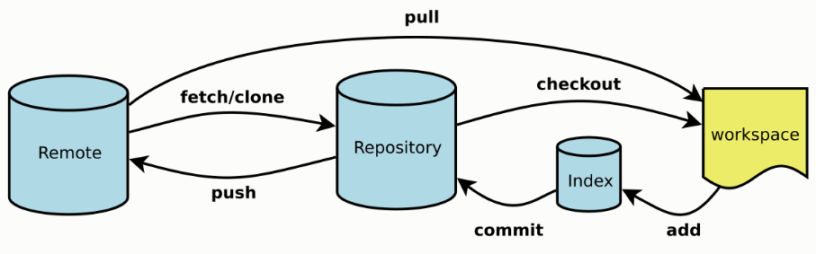
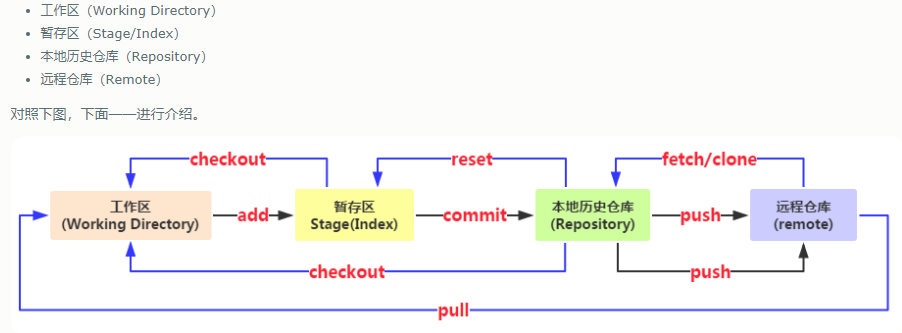

### git快速入门
**简介：**
git其实是一个不用网络的仓库(本地仓库)，你可以把数据push到github上(远程仓库)。pull和push操作都是本地仓库和远程仓库之间的数据交互。
**本地：**

1. 工作区(working directory)
2. 暂存区(stage/index)
3. 本次仓库(Repository)

**流程：**
初次提交：
git add  将文件 工作区--->暂存区
git commit将文件 暂存区--->本地仓库
git push 将文件 本地仓库--->远程库

提交改动
git commit 将文件 暂存区--->本地仓库
git push 将文件 分支--->远程库

pull&push
git pull 远程--->本地仓库
put push 本地仓库--->远程

**参考：**
https://www.cnblogs.com/hoxis/p/9887439.html

**图解：**

