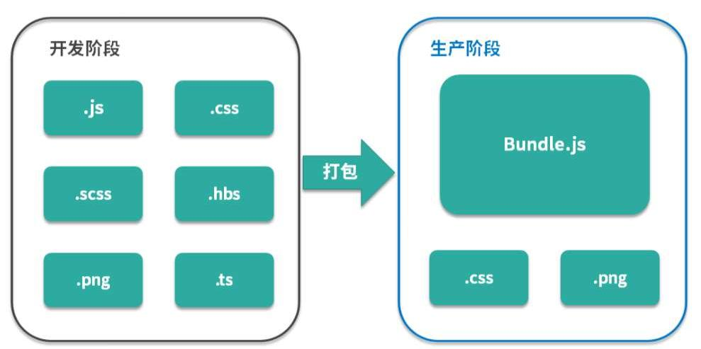

### 1.Webpack所解决的问题
	如何在前端项目中高效地管理和维护项目中每一个资源
### 2.模块化的演进过程
**1.文件划分方式**
**简介：**
每一个文件作为一个模块
**代码示例：**
```
//详见 demo/
```
**缺点：**

* 模块直接在全局工作，大量模块成员污染全局作用域
* 没有私有空间，所有模块内的成员都可以在模块外被访问或者修改
* 一旦模块增多，容易产生命名冲突
* 无法管理模块与模块之间的依赖关系
* 在维护过程中也很难分辨每个成员所属的模块


**2.命名空间方式**
**简介：**
每个模块只暴露一个全局对象，所有模块成员都挂载到这个全局对象中
**代码示例：**
```
//详见demo2/
```
**缺点:**
只解决了命名冲突的问题，其他问题依然存在


**3.立即执行函数表达式**
**简介：**
将每个模块成员都放在一个立即执行函数所形成的私有作用域中，对于需要暴露给外部的成员，通过挂到全局对象的方式实现
**代码示例：**
```
//见demo3/
```
**优点：**
私有成员只能在模块成员内部通过闭包的形式访问，成功解决了前面提到的全局作用域污染和命名冲突的问题。

**4.立即执行函数表达式 依赖参数**
**说明**：
可以将立即执行函数表达式的参数作为依赖声明使用
**代码示例：**
```
//详见demo4/
```

**模块加载的问题：**
以上四个阶段对模块化的落地方式解决了很多在前端领域实现模块化的问题但是仍然存在一些没有解决的问题！
**代码示例:**
```
//详见demo5/
```
**总结：**
通过script标签的方式直接在页面中引入这些模块，这意味着模块的加载不受代码的控制，时间久了不利于维护。
理想的方式是在页面中引入一个JS入口文件，其余用到的模块可以通过代码控制，按需加载进来。

**5.模块化规范的出现**


**6.模块打包工具的出现**
**模块化的问题：**

**打包工具所需具备的能力:**
**1.编译代码的能力**
**目的：**
为了解决兼容性问题

**2.零散代码打包的能力**
**目的：**
只是在开发阶段需要模块化的文件划分，但是到实际运行阶段就没必要了

**3.支持不同种类的前端模块类型**
**目的：**
将开发过程中涉及到的样式、图片、字体等所有资源文件都作为模块使用，这样我们就拥有了一个统一的模块化方案，所有资源文件的加载都可以通过代码控制，与业务代码统一维护，更为合理。
